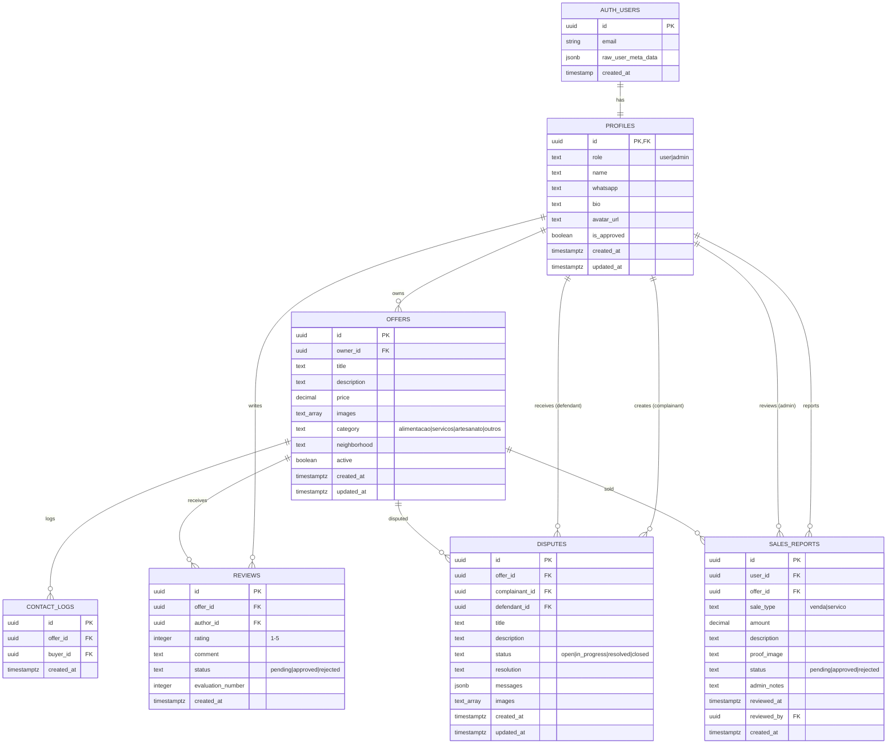

# 📘 DOCUMENTAÇÃO TÉCNICA - PRÓ-FAMÍLIA CONECTA

**Versão:** 1.0.0  
**Data:** Fevereiro 2025  
**Autor:** Documentação gerada por Arquiteto de Software

---

## Índice

1. [Visão Geral e Arquitetura](#1-visão-geral-e-arquitetura)
2. [Banco de Dados e Modelagem](#2-banco-de-dados-e-modelagem)
3. [Documentação de API e Rotas](#3-documentação-de-api-e-rotas)
4. [Guia de Instalação e Deploy](#4-guia-de-instalação-e-deploy)
5. [Estrutura de Diretórios](#5-estrutura-de-diretórios)
6. [Manual Básico de Funcionalidades](#6-manual-básico-de-funcionalidades)

---

## 1. Visão Geral e Arquitetura

### 1.1 Propósito

O **Pró-Família Conecta** é uma plataforma de marketplace social projetada para comunidades locais. O sistema permite que membros de uma comunidade ofertem produtos e serviços, avaliem vendedores, reportem vendas realizadas e solicitem mediação em caso de conflitos.

#### Regras de Negócio Principais:

1. **Cadastro com Aprovação:** Novos usuários precisam ser aprovados por um administrador antes de publicar ofertas
2. **Moderação de Conteúdo:** Ofertas e avaliações passam por moderação administrativa
3. **Sistema de Confiança:** Avaliações públicas (1-5 estrelas) após aprovação do admin
4. **Controle Financeiro:** Vendas reportadas precisam de comprovante e aprovação do admin
5. **Mediação de Conflitos:** Sistema de disputas entre compradores e vendedores

### 1.2 Stack Tecnológico

| Camada | Tecnologia | Versão | Propósito |
|--------|------------|--------|-----------|
| **Frontend** | React | 19.x | Interface do usuário (SPA) |
| **Estilização** | Tailwind CSS | 3.4.x | Framework CSS utilitário |
| **Componentes UI** | Shadcn/UI | - | Biblioteca de componentes acessíveis |
| **Roteamento** | React Router DOM | 7.x | Navegação client-side |
| **Backend** | FastAPI | - | API REST (Python) |
| **Banco de Dados** | PostgreSQL | - | Via Supabase |
| **Autenticação** | Supabase Auth | - | Gerenciamento de sessões |
| **Storage** | Supabase Storage | - | Armazenamento de imagens |
| **Cache/Logs** | MongoDB | - | Logs auxiliares via backend |
| **Notificações** | Evolution API v2 | - | Integração WhatsApp (opcional) |
| **Relatórios** | jsPDF + jspdf-autotable | 4.x / 5.x | Geração de PDF |

### 1.3 Arquitetura

O sistema segue uma arquitetura **Serverless Hybrid SPA**:

```
┌─────────────────────────────────────────────────────────────────┐
│                        CLIENTE (Browser)                         │
│  ┌─────────────────────────────────────────────────────────────┐ │
│  │                    React SPA (Frontend)                      │ │
│  │  - Componentes UI (Shadcn/UI)                               │ │
│  │  - Gerenciamento de Estado (useState/useEffect)              │ │
│  │  - Roteamento (React Router)                                 │ │
│  └─────────────────────────────────────────────────────────────┘ │
└───────────────────────────┬─────────────────────────────────────┘
                            │
            ┌───────────────┴───────────────┐
            │                               │
            ▼                               ▼
┌───────────────────────┐       ┌───────────────────────┐
│   SUPABASE (BaaS)     │       │   FASTAPI BACKEND     │
│  ┌─────────────────┐  │       │  ┌─────────────────┐  │
│  │ PostgreSQL      │  │       │  │ WhatsApp Proxy  │  │
│  │ (Banco Principal)│  │       │  │ (Evolution API) │  │
│  └─────────────────┘  │       │  └─────────────────┘  │
│  ┌─────────────────┐  │       │  ┌─────────────────┐  │
│  │ Auth (RLS)      │  │       │  │ MongoDB         │  │
│  │ (Autenticação)  │  │       │  │ (Logs/Cache)    │  │
│  └─────────────────┘  │       │  └─────────────────┘  │
│  ┌─────────────────┐  │       └───────────────────────┘
│  │ Storage         │  │
│  │ (Imagens)       │  │
│  └─────────────────┘  │
└───────────────────────┘
```

#### Padrões Arquiteturais:

- **SPA (Single Page Application):** Frontend React com roteamento client-side
- **BaaS (Backend as a Service):** Supabase para dados, auth e storage
- **Proxy Pattern:** Backend FastAPI como proxy para APIs HTTP externas
- **RLS (Row Level Security):** Segurança a nível de linha no PostgreSQL

---

## 2. Banco de Dados e Modelagem

### 2.1 Diagrama Entidade-Relacionamento



### 2.2 Descrição das Tabelas

| Tabela | Propósito | Registros Esperados |
|--------|-----------|---------------------|
| `profiles` | Perfis de usuário vinculados ao Supabase Auth | Centenas a milhares |
| `offers` | Produtos e serviços ofertados | Milhares |
| `reviews` | Avaliações de ofertas (1-5 estrelas) | Milhares |
| `disputes` | Mediações/conflitos entre usuários | Dezenas a centenas |
| `contact_logs` | Log de interesses demonstrados | Milhares |
| `sales_reports` | Vendas reportadas com comprovante | Centenas a milhares |

### 2.3 Índices de Performance

```sql
-- Índices críticos para queries frequentes
idx_profiles_is_approved    -- Filtro de usuários aprovados
idx_profiles_role           -- Filtro de administradores
idx_offers_owner_id         -- Ofertas por dono
idx_offers_active           -- Ofertas ativas (homepage)
idx_offers_category         -- Filtro por categoria
idx_reviews_offer_id        -- Reviews de uma oferta
idx_reviews_status          -- Reviews pendentes (admin)
idx_disputes_status         -- Disputas por status
idx_sales_reports_user_id   -- Vendas por usuário
idx_sales_reports_status    -- Vendas pendentes (admin)
idx_sales_reports_created_at -- Ordenação cronológica
```

### 2.4 Políticas de Segurança (RLS)

O sistema utiliza **Row Level Security** nativo do PostgreSQL. Resumo das políticas:

| Tabela | SELECT | INSERT | UPDATE | DELETE |
|--------|--------|--------|--------|--------|
| `profiles` | Público | Próprio | Próprio/Admin | - |
| `offers` | Ativas/Dono/Admin | Aprovados | Dono/Admin | Dono/Admin |
| `reviews` | Aprovadas/Autor/Admin | Autenticados | Admin | - |
| `disputes` | Participantes/Admin | Autenticados | Participantes/Admin | - |
| `contact_logs` | Admin | Público | - | - |
| `sales_reports` | Próprio/Admin | Próprio | Admin | Admin |

---

## 3. Documentação de API e Rotas

### 3.1 Rotas do Frontend (React Router)

| Rota | Componente | Acesso | Descrição |
|------|------------|--------|-----------|
| `/` | `HomePage` | Público | Listagem de ofertas ativas |
| `/auth` | `AuthPage` | Público | Login e cadastro |
| `/minhas-ofertas` | `MyOffersPage` | Autenticado | Gerenciar ofertas próprias |
| `/admin` | `AdminPage` | Admin | Painel administrativo |
| `/mediacao` | `MediationPage` | Autenticado | Criar/visualizar mediações |
| `/oferta/:id` | `OfferDetailsPage` | Público | Detalhes de uma oferta |
| `/perfil` | `ProfilePage` | Autenticado | Editar perfil próprio |

### 3.2 API Backend (FastAPI)

**Base URL:** `{BACKEND_URL}/api`

#### 3.2.1 Health Check

```http
GET /api/
```
**Response:** `200 OK`
```json
{ "message": "Hello World" }
```

#### 3.2.2 Status Check (MongoDB)

```http
POST /api/status
Content-Type: application/json

{
  "client_name": "string"
}
```
**Response:** `200 OK`
```json
{
  "id": "uuid",
  "client_name": "string",
  "timestamp": "ISO8601"
}
```

```http
GET /api/status
```
**Response:** `200 OK`
```json
[
  {
    "id": "uuid",
    "client_name": "string",
    "timestamp": "ISO8601"
  }
]
```

#### 3.2.3 WhatsApp Proxy

```http
POST /api/whatsapp/send
Content-Type: application/json

{
  "number": "5511999999999",
  "text": "Mensagem a enviar"
}
```
**Response:** `200 OK`
```json
{
  "success": true,
  "data": { /* resposta da Evolution API */ }
}
```
**Errors:**
- `503`: WhatsApp API não configurada
- `500`: Erro ao enviar mensagem

### 3.3 API Supabase (Acesso Direto do Frontend)

O frontend acessa diretamente o Supabase usando o cliente JavaScript. Exemplos de operações:

```javascript
// Listar ofertas ativas
supabase.from('offers').select('*').eq('active', true)

// Criar oferta
supabase.from('offers').insert([{ ... }])

// Upload de imagem
supabase.storage.from('offer-images').upload(filePath, file)

// Autenticação
supabase.auth.signInWithPassword({ email, password })
supabase.auth.signUp({ email, password, options: { data: { name, whatsapp } } })
```

---

## 4. Guia de Instalação e Deploy

### 4.1 Pré-requisitos

| Software | Versão Mínima | Propósito |
|----------|---------------|-----------|
| Node.js | 18.x | Runtime JavaScript |
| Yarn | 1.22.x | Gerenciador de pacotes |
| Python | 3.10+ | Backend FastAPI |
| MongoDB | 6.x | Logs/cache (opcional) |
| Supabase Account | - | Banco de dados principal |

### 4.2 Variáveis de Ambiente

#### Frontend (`.env`)

| Variável | Obrigatória | Descrição |
|----------|-------------|-----------|
| `REACT_APP_SUPABASE_URL` | ✅ | URL do projeto Supabase |
| `REACT_APP_SUPABASE_ANON_KEY` | ✅ | Chave anônima do Supabase |
| `REACT_APP_BACKEND_URL` | ✅ | URL do backend FastAPI |
| `REACT_APP_WHATSAPP_API_URL` | ❌ | URL da Evolution API |
| `REACT_APP_WHATSAPP_API_KEY` | ❌ | API Key da Evolution API |
| `REACT_APP_ADMIN_WHATSAPP` | ❌ | WhatsApp do admin para notificações |

#### Backend (`.env`)

| Variável | Obrigatória | Descrição |
|----------|-------------|-----------|
| `MONGO_URL` | ✅ | String de conexão MongoDB |
| `DB_NAME` | ✅ | Nome do banco MongoDB |
| `WHATSAPP_API_URL` | ❌ | URL da Evolution API |
| `WHATSAPP_API_KEY` | ❌ | API Key da Evolution API |
| `CORS_ORIGINS` | ❌ | Origens permitidas (separadas por vírgula) |

### 4.3 Comandos de Instalação

#### Frontend

```bash
cd frontend
cp .env.example .env
# Editar .env com suas credenciais

yarn install        # Instalar dependências
yarn start          # Desenvolvimento (porta 3000)
yarn build          # Build de produção
```

#### Backend

```bash
cd backend
cp .env.example .env
# Editar .env com suas credenciais

pip install -r requirements.txt

# Desenvolvimento
uvicorn server:app --host 0.0.0.0 --port 8001 --reload

# Produção
uvicorn server:app --host 0.0.0.0 --port $PORT
```

### 4.4 Configuração do Supabase

1. Criar projeto no [supabase.com](https://supabase.com)
2. Executar `/database/schema.sql` no SQL Editor
3. Criar bucket `offer-images` no Storage:
   - Public: ✅
   - File size limit: 5MB
   - Allowed types: `image/jpeg, image/png, image/webp`
4. Copiar URL e Anon Key de Settings > API

### 4.5 Deploy

#### Frontend (Vercel/Netlify)

```yaml
Build Command: yarn build
Output Directory: build
Install Command: yarn install
```

#### Backend (Railway/Render)

```yaml
Start Command: uvicorn server:app --host 0.0.0.0 --port $PORT
```

---

## 5. Estrutura de Diretórios

```
pro-familia-conecta/
│
├── README.md                    # Documentação principal
├── DOCUMENTATION.md             # Esta documentação técnica
├── .gitignore                   # Arquivos ignorados pelo Git
│
├── database/
│   └── schema.sql               # Script SQL mestre (idempotente)
│
├── backend/
│   ├── server.py                # API FastAPI principal
│   ├── requirements.txt         # Dependências Python
│   ├── .env                     # Configurações locais (não versionado)
│   └── .env.example             # Template de configurações
│
└── frontend/
    ├── public/
    │   └── index.html           # HTML base
    │
    ├── src/
    │   ├── components/          # Componentes reutilizáveis
    │   │   ├── ui/              # Componentes Shadcn/UI (50+ arquivos)
    │   │   ├── Header.js        # Cabeçalho com navegação
    │   │   ├── ImageUpload.js   # Upload de imagens com crop
    │   │   ├── ReportSaleForm.js # Formulário de reportar venda
    │   │   └── ReviewForm.js    # Formulário de avaliação
    │   │
    │   ├── hooks/
    │   │   └── use-toast.js     # Hook para notificações toast
    │   │
    │   ├── lib/
    │   │   ├── supabase.js      # Cliente Supabase
    │   │   ├── whatsappService.js # Serviço de notificações WhatsApp
    │   │   ├── pdfReport.js     # Geração de relatórios PDF
    │   │   └── utils.js         # Utilitários (cn, etc.)
    │   │
    │   ├── pages/
    │   │   ├── AdminPage.js     # Painel administrativo (79KB)
    │   │   ├── AuthPage.js      # Login/Cadastro
    │   │   ├── DisputesPage.js  # Listagem de disputas
    │   │   ├── HomePage.js      # Página inicial (ofertas)
    │   │   ├── MediationPage.js # Criar/gerenciar mediações
    │   │   ├── MyOffersPage.js  # Minhas ofertas
    │   │   ├── OfferDetailsPage.js # Detalhes de oferta
    │   │   └── ProfilePage.js   # Perfil do usuário
    │   │
    │   ├── App.js               # Componente raiz + rotas
    │   ├── App.css              # Estilos globais
    │   ├── index.js             # Entry point
    │   └── index.css            # Tailwind imports
    │
    ├── package.json             # Dependências Node.js
    ├── yarn.lock                # Lock file
    ├── tailwind.config.js       # Configuração Tailwind
    ├── postcss.config.js        # Configuração PostCSS
    ├── craco.config.js          # Configuração CRACO (aliases)
    ├── jsconfig.json            # Configuração JS (paths)
    ├── components.json          # Configuração Shadcn/UI
    ├── .env                     # Configurações locais (não versionado)
    └── .env.example             # Template de configurações
```

---

## 6. Manual Básico de Funcionalidades

### 6.1 Fluxo de Cadastro de Usuário

```
┌─────────────┐     ┌─────────────┐     ┌─────────────┐     ┌─────────────┐
│  /auth      │────▶│  Preencher  │────▶│  Supabase   │────▶│  Aguardar   │
│  (Cadastro) │     │  Formulário │     │  signUp()   │     │  Aprovação  │
└─────────────┘     └─────────────┘     └─────────────┘     └─────────────┘
                                                                   │
                                               ┌───────────────────┘
                                               ▼
                                        ┌─────────────┐
                                        │  Admin      │
                                        │  Aprova     │
                                        └─────────────┘
```

**Campos do Formulário:**
- Nome completo
- Email
- Senha
- WhatsApp (com seletor de código de país)

**Regras:**
- Trigger automático cria perfil em `profiles`
- Usuário inicia com `is_approved = false`
- Admin deve aprovar para liberar publicação de ofertas

### 6.2 Fluxo de Criação de Oferta

```
┌─────────────┐     ┌─────────────┐     ┌─────────────┐     ┌─────────────┐
│  /minhas-   │────▶│  Preencher  │────▶│  Upload     │────▶│  Salvar     │
│  ofertas    │     │  Dados      │     │  Imagens    │     │  (inactive) │
└─────────────┘     └─────────────┘     └─────────────┘     └─────────────┘
                                                                   │
                                               ┌───────────────────┘
                                               ▼
                                        ┌─────────────┐     ┌─────────────┐
                                        │  Admin      │────▶│  Oferta     │
                                        │  Aprova     │     │  Ativa      │
                                        └─────────────┘     └─────────────┘
```

**Campos do Formulário:**
- Título
- Descrição
- Preço (opcional)
- Categoria (Alimentação, Serviços, Artesanato, Outros)
- Bairro
- Imagens (até 5, com crop)

**Regras:**
- Apenas usuários aprovados podem criar ofertas
- Ofertas iniciam como `active = false`
- Admin deve aprovar para tornar visível

### 6.3 Fluxo de Avaliação

```
┌─────────────┐     ┌─────────────┐     ┌─────────────┐     ┌─────────────┐
│  /oferta/   │────▶│  Clicar em  │────▶│  Preencher  │────▶│  Salvar     │
│  :id        │     │  Avaliar    │     │  Nota/Coment│     │  (pending)  │
└─────────────┘     └─────────────┘     └─────────────┘     └─────────────┘
                                                                   │
                                               ┌───────────────────┘
                                               ▼
                                        ┌─────────────┐     ┌─────────────┐
                                        │  Admin      │────▶│  Review     │
                                        │  Modera     │     │  Pública    │
                                        └─────────────┘     └─────────────┘
```

**Regras:**
- Permite múltiplas avaliações do mesmo usuário para mesma oferta
- Admin recebe notificação WhatsApp (se configurado)
- Sistema alerta admin sobre avaliações repetidas

### 6.4 Fluxo de Reportar Venda

```
┌─────────────┐     ┌─────────────┐     ┌─────────────┐     ┌─────────────┐
│  /minhas-   │────▶│  Selecionar │────▶│  Preencher  │────▶│  Upload     │
│  ofertas    │     │  Oferta     │     │  Valor/Tipo │     │  Comprovante│
└─────────────┘     └─────────────┘     └─────────────┘     └─────────────┘
                                                                   │
                                               ┌───────────────────┘
                                               ▼
                                        ┌─────────────┐     ┌─────────────┐
                                        │  Admin      │────▶│  Venda      │
                                        │  Aprova     │     │  Contabiliza│
                                        └─────────────┘     └─────────────┘
```

**Campos:**
- Oferta (select)
- Tipo (Venda ou Serviço)
- Valor (R$)
- Descrição (opcional)
- Comprovante de pagamento (imagem)

### 6.5 Fluxo de Mediação/Disputa

```
┌─────────────┐     ┌─────────────┐     ┌─────────────┐     ┌─────────────┐
│  /mediacao  │────▶│  Selecionar │────▶│  Descrever  │────▶│  Salvar     │
│             │     │  Vendedor   │     │  Problema   │     │  (open)     │
└─────────────┘     └─────────────┘     └─────────────┘     └─────────────┘
                                                                   │
                           ┌───────────────────────────────────────┘
                           ▼
┌─────────────┐     ┌─────────────┐     ┌─────────────┐     ┌─────────────┐
│  Admin      │────▶│  Mensagens  │────▶│  Resolução  │────▶│  Disputa    │
│  Medeia     │     │  Chat       │     │  Registrada │     │  Fechada    │
└─────────────┘     └─────────────┘     └─────────────┘     └─────────────┘
```

**Status possíveis:**
- `open`: Aguardando mediação
- `in_progress`: Em andamento
- `resolved`: Resolvida
- `closed`: Encerrada

### 6.6 Painel Administrativo

O admin tem acesso a:

| Aba | Funcionalidade |
|-----|----------------|
| **Métricas** | Dashboard com KPIs, exportar PDF |
| **Perfis Pendentes** | Aprovar/rejeitar novos usuários |
| **Ofertas Pendentes** | Ativar/desativar ofertas |
| **Vendas** | Aprovar/rejeitar vendas reportadas |
| **Avaliações** | Moderar reviews |
| **Mediações** | Gerenciar disputas |
| **Todas Ofertas** | Visualizar e gerenciar todas ofertas |
| **Perfis** | Pesquisar e visualizar todos usuários |

---

## Notas Técnicas

### TODO / Requer Atenção

1. **AdminPage.js (79KB):** Arquivo muito grande. Considerar dividir em subcomponentes:
   - `AdminMetrics.js`
   - `AdminProfiles.js`
   - `AdminOffers.js`
   - `AdminSales.js`
   - `AdminReviews.js`
   - `AdminDisputes.js`

2. **Backend Simplificado:** O backend FastAPI atualmente serve apenas como proxy para WhatsApp. Toda lógica de negócio está no frontend via Supabase. Considerar migrar regras críticas para backend.

3. **Testes Automatizados:** Não há testes unitários ou de integração. Recomenda-se implementar:
   - Jest/React Testing Library (frontend)
   - pytest (backend)

4. **Logs de Auditoria:** O sistema não registra logs de auditoria para ações administrativas. Considerar implementar.

5. **Rate Limiting:** Não há rate limiting nas APIs. Implementar para produção.

---

## Changelog

| Versão | Data | Alterações |
|--------|------|------------|
| 1.0.0 | Fev/2025 | Release inicial |

---

*Documentação gerada automaticamente. Última atualização: Fevereiro 2025*
